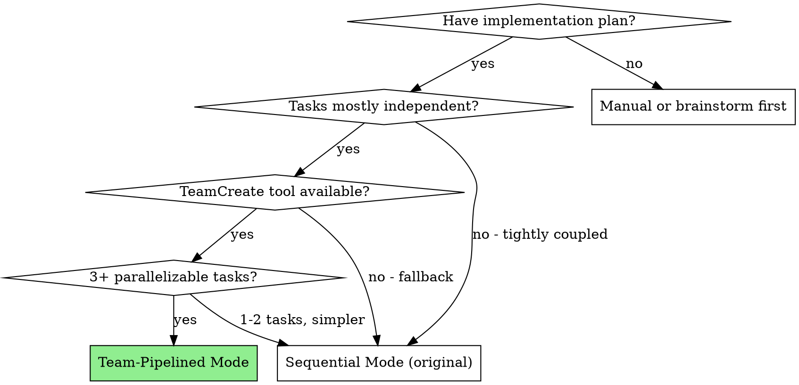
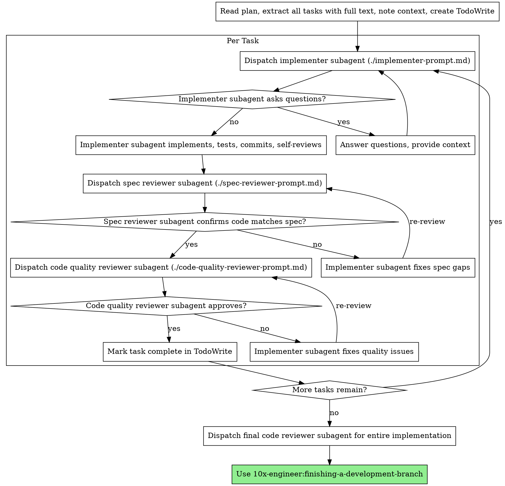

# Subagent-Driven Development

Execute plan by dispatching fresh subagent per task, with two-stage review after each: spec compliance review first, then code quality review.

**Core principle:** Fresh subagent per task + two-stage review (spec then quality) = high quality, fast iteration

## Teams Availability Check

Before starting execution, check if the Teams feature is available. Teams enables a **pipelined mode** where multiple implementers work concurrently while a dedicated reviewer handles completed work.



**How to check:** Attempt to use `TeamCreate`. If it's not in your available tools, fall back to Sequential Mode.

## Sequential Mode (Original / Fallback)

Use when Teams isn't available, tasks are tightly coupled, or you have only 1-2 tasks.

### The Process



## Team-Pipelined Mode (3+ Parallelizable Tasks)

When Teams is available and the plan has 3+ tasks that can be worked on concurrently, use pipelined execution: multiple implementer teammates work in parallel while you coordinate reviews.

### Architecture

```
┌─────────────────────────────────────────────┐
│            You (Team Lead)                   │
│  - Creates team + task list from plan        │
│  - Assigns tasks via TaskUpdate              │
│  - Reviews completed work (spec + quality)   │
│  - Sends feedback via SendMessage            │
│  - Shuts down team when all tasks pass       │
└──────┬──────────┬──────────────┬─────────────┘
       │          │              │
       ▼          ▼              ▼
┌──────────┐ ┌──────────┐ ┌──────────┐
│implmtr-1 │ │implmtr-2 │ │implmtr-3 │
│(general) │ │(general) │ │(general) │
│Task 1    │ │Task 2    │ │Task 3    │
└──────────┘ └──────────┘ └──────────┘
```

### Setup

```
1. TeamCreate(team_name="implement-feature", description="Execute plan: [feature name]")

2. For each task in plan:
   TaskCreate(
     subject="Task N: [name]",
     description="[FULL task text from plan, not a reference]",
     activeForm="Implementing [name]"
   )

3. Set dependencies from plan:
   TaskUpdate(taskId="4", addBlockedBy=["1", "2"])  // Task 4 needs 1 and 2 done first

4. Spawn implementer teammates (one per parallelizable task, max 4):
   Task(name="implementer-1", team_name="implement-feature", subagent_type="general-purpose",
        prompt="[Use ./implementer-prompt.md template with team additions - see below]")
   Task(name="implementer-2", ...)
```

### Teammate Implementer Prompt Additions

When using Team Mode, add these to the standard implementer prompt (./implementer-prompt.md):

```markdown
## Team Context

You are a teammate on team "{team_name}". Your workflow:

1. Call TaskList to see available tasks
2. Claim an unblocked, unassigned task with TaskUpdate(taskId=X, owner="your-name", status="in_progress")
3. Read full task description with TaskGet
4. Implement the task (same quality standards as always)
5. When done, mark TaskUpdate(taskId=X, status="completed")
6. Send a message to the team lead: SendMessage(type="message", recipient="team-lead-name",
     content="Completed Task N: [summary of what was done, files changed, test results]",
     summary="Task N complete")
7. Check TaskList for more available work
8. If no more tasks available, wait for assignment or shutdown

If you have questions, use SendMessage to ask the team lead. Do NOT guess.
If you encounter a conflict (another teammate edited a file you need), message the team lead.
```

### Team Lead Review Workflow

As team lead, when a teammate reports completion:

1. **Spec review** — Dispatch a spec reviewer subagent (./spec-reviewer-prompt.md) for the completed task
2. **If spec fails** — `SendMessage` the implementer teammate with specific issues to fix
3. **If spec passes** — Dispatch code quality reviewer (./code-quality-reviewer-prompt.md)
4. **If quality fails** — `SendMessage` the implementer with issues
5. **If quality passes** — Task is truly done. Check if any blocked tasks are now unblocked.

This pipelines the work: while you review Task 1, implementers are working on Tasks 2 and 3.

### Shutdown

When all tasks are reviewed and approved:
```
SendMessage(type="shutdown_request", recipient="implementer-1", content="All tasks complete")
SendMessage(type="shutdown_request", recipient="implementer-2", content="All tasks complete")
// ... for each teammate
// After all acknowledge:
TeamDelete()
```

Then proceed to: **10x-engineer:finishing-a-development-branch**

## Prompt Templates

- `./implementer-prompt.md` - Dispatch implementer subagent
- `./spec-reviewer-prompt.md` - Dispatch spec compliance reviewer subagent
- `./code-quality-reviewer-prompt.md` - Dispatch code quality reviewer subagent

## Example Workflow (Sequential Mode)

```
You: I'm using Subagent-Driven Development to execute this plan.

[Read plan file once: docs/plans/feature-plan.md]
[Extract all 5 tasks with full text and context]
[Create TodoWrite with all tasks]

Task 1: Hook installation script

[Dispatch implementation subagent with full task text + context]

Implementer: "Before I begin - should the hook be installed at user or system level?"
You: "User level (~/.config/superpowers/hooks/)"
Implementer: Implemented, 5/5 tests passing, committed

[Spec reviewer]: ✅ Spec compliant
[Code reviewer]: ✅ Approved
[Mark Task 1 complete]

Task 2: Recovery modes
... (same pattern)
```

## Example Workflow (Team-Pipelined Mode)

```
You: I'm using Subagent-Driven Development in team-pipelined mode.

[Read plan, extract 5 tasks]
[TeamCreate("implement-auth")]
[TaskCreate for each task, set dependencies]
[Spawn 3 implementer teammates]

implementer-1: "Completed Task 1: Added login endpoint, 4/4 tests pass"
  [You dispatch spec reviewer for Task 1]
implementer-2: "Completed Task 2: Added session middleware, 3/3 tests pass"
  [You dispatch spec reviewer for Task 2 — pipelined with Task 1 review]
implementer-3: "Question about Task 3: which hash algorithm for passwords?"
  [You SendMessage: "Use bcrypt with cost factor 12"]

[Spec reviewer Task 1]: ✅
  [You dispatch code quality reviewer for Task 1]
[Spec reviewer Task 2]: ❌ Missing CSRF protection
  [You SendMessage implementer-2: "Add CSRF token validation per spec requirement 3"]

implementer-2: "Fixed, re-committed"
  [You re-dispatch spec reviewer]

... (pipeline continues)

[All tasks reviewed and approved]
[Shutdown teammates, TeamDelete]
[finishing-a-development-branch]
```

## Red Flags

**Never (both modes):**
- Skip reviews (spec compliance OR code quality)
- Proceed with unfixed issues
- Make subagent read plan file (provide full text instead)
- Skip scene-setting context
- Accept "close enough" on spec compliance
- **Start code quality review before spec compliance is ✅**

**Sequential mode only:**
- Dispatch multiple implementation subagents in parallel (use Team-Pipelined instead)

**Team-Pipelined mode only:**
- Spawn more than 4-5 teammates (diminishing returns, coordination overhead)
- Let teammates work on tasks that edit the same files (conflict risk)
- Skip shutdown protocol (teammates keep running)
- Forget to check if blocked tasks unblock after completions

**If teammate asks questions:**
- Answer via `SendMessage` clearly and completely
- Don't rush them into implementation

**If reviewer finds issues:**
- In sequential: Implementer fixes, reviewer re-reviews
- In team: `SendMessage` the teammate with specific fixes needed, re-review after they report completion

## Integration

**Required workflow skills:**
- **10x-engineer:writing-plans** - Creates the plan this skill executes
- **10x-engineer:requesting-code-review** - Code review template for reviewer subagents
- **10x-engineer:finishing-a-development-branch** - Complete development after all tasks

**Subagents should use:**
- **10x-engineer:test-driven-development** - Subagents follow TDD for each task

**Alternative workflow:**
- **10x-engineer:executing-plans** - Use for parallel session instead of same-session execution
