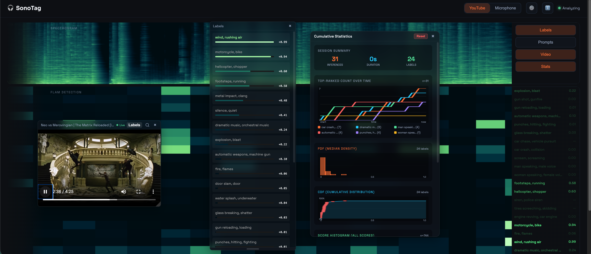

# SonoTag



> 🪦 **Public demo retired** — `sonotag.app` was pulled when the ongoing hosting cost outweighed the demo value. This repo + screenshot preserve the architecture and UI; you can still run it locally with the install scripts below.

SonoTag is a modern web console for live microphone input, frequency-range
inspection, and real-time audio diagnostics. It pairs a lightweight React UI
with a FastAPI backend that hosts FLAM inference.

---

## 🔗 Related Projects

| Project | Description |
|---------|-------------|
| [GeoNoise](https://geonoise.app) | Environmental noise modeling with ISO 9613-2 propagation |
| [Cellcraft](https://cellcraft.dev) | Browser-based ecosystem simulation with genetics and population dynamics |

---

## What you get today
- Mic selection, permission flow, and live level meter.
- Real-time spectrogram with adjustable frequency range.
- System Snapshot panel with host specs (backend) and browser caps.
- Buffer recommendation placeholder (backend heuristic for now).

## Quick start
Windows:
```bat
install.bat
run.bat
```

macOS:
```bash
chmod +x *.command
./install.command
./run.command
```

## Requirements
- Python 3.10-3.12 (3.11 recommended for OpenFLAM). Install scripts can prompt to install 3.11.
- Node.js 18+ (npm included)
- Git (for auto-cloning OpenFLAM during install)

## Architecture
- `frontend/`: Vite + React UI.
- `backend/`: FastAPI service for system info and future FLAM inference.
- `docs/roadmap.md`: product vision, milestones, and next steps.

## Notes
- Browser hardware metrics can be capped by privacy settings; host specs come
  from the backend.
- OpenFLAM is a separate repo clone in `openflam/` and is not tracked here.
- OpenFLAM is under a non-commercial license; review before deployment.
- For more details, see `docs/dev.md`, `docs/roadmap.md`, and
  `docs/flam_integration.md`.
- The install scripts can optionally download the FLAM model weights.
- Install scripts will recreate `backend/.venv` if it was created with an unsupported Python version.
