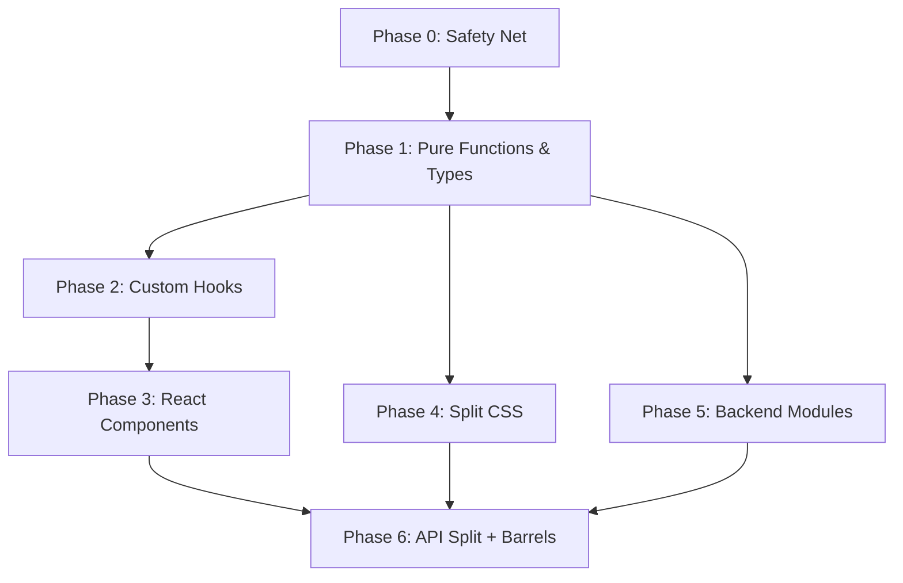

# SonoTag Modularization Plan

> **Date:** 2026-02-19
> **Based on:** `.claude/rules/modular-architecture.md`
> **Approach:** Strangler Fig — incremental extraction, never break the build

---

## Executive Summary

SonoTag currently lives in **3 god-files**:

| File | Lines | Severity |
|------|-------|----------|
| `frontend/src/App.tsx` | **6,081** | 🔴 Catastrophic — 20× the 300-line threshold |
| `backend/app/main.py` | **2,204** | 🔴 Critical — 7× threshold |
| `frontend/src/styles.css` | **1,158** | 🟠 High — 2× the CSS threshold |

Everything else (`types.ts` at 214, `api.ts` at 337, `main.tsx` at 16) is healthy.

The plan decomposes these into **~40 focused modules** across 6 phases, each phase producing a working build.

---

## Current Health Audit

### Four Questions Test

| Question | `App.tsx` | `main.py` | `styles.css` |
|----------|-----------|-----------|--------------|
| **Cohesion** — needs "and"? | ❌ "audio capture **and** canvas drawing **and** video modals **and** stats **and** webcam **and** settings **and** YouTube **and** SoundCloud" | ❌ "model loading **and** classification **and** YouTube download **and** video streaming **and** system health **and** URL analysis" | ❌ "layout **and** toolbar **and** modals **and** canvas **and** themes **and** animations" |
| **Navigability** — find things quickly? | ❌ 50+ useState hooks, buried among 6K lines | ❌ 14+ endpoints mixed with classes and helpers | ❌ 1,158 lines, no section imports |
| **Testability** — test in isolation? | ❌ Zero tests possible — everything coupled to React lifecycle | ❌ No unit tests — logic inlined in route handlers | ❌ N/A |
| **Explainability** — understand in one read? | ❌ Impossible in one sitting | ❌ Very difficult | ❌ Difficult |

### Diagnostic Symptoms Present

| Symptom | Found? | Where |
|---------|--------|-------|
| File > 500 lines | ✅ | App.tsx (6,081), main.py (2,204), styles.css (1,158) |
| Function > 50 lines | ✅ | `function App()` is 5,475 lines; `download_from_url()` is 134 lines; `analyze_youtube` endpoint is 220 lines |
| > 10 imports | ✅ | App.tsx imports from react (6) + types (8) + api (8) = 22 symbols |
| Need "and" to describe file | ✅ | All three god-files |
| Agent reads 500+ lines for small change | ✅ | Any change to App.tsx requires reading 6K lines |
| CSS file > 500 lines | ✅ | styles.css at 1,158 |
| No barrel exports | ✅ | Zero index.ts files in the project |
| Duplicate constants | ✅ | `API_BASE_URL` defined in both App.tsx and api.ts |

### What's Already Clean ✅

- `types.ts` — well-organized, 214 lines, clear sections
- `api.ts` — 337 lines, borderline but reasonably scoped (8 API functions + 2 helpers)
- `main.tsx` — 16 lines, pure orchestration entry point
- No bare `let` at module scope (all `const`/`type`)
- tsconfig has strict mode + path aliases (`@/*`)

---

## Target Architecture

### Frontend (`frontend/src/`)

```
src/
├── main.tsx                          # Entry point (unchanged, 16 lines)
├── App.tsx                           # Orchestration only (~150 lines)
│
├── types/
│   ├── api.ts                        # API response types (from current types.ts)
│   ├── app.ts                        # Frontend state types, PermissionState, MonitoringStatus, InputMode
│   ├── themes.ts                     # ColorTheme type + theme objects
│   └── index.ts                      # Barrel export
│
├── constants/
│   ├── audio.ts                      # Buffer sizes, sample rates, frame skip map
│   ├── prompts.ts                    # All prompt presets (DEFAULT, DIALOG, NATURE, etc.)
│   └── index.ts                      # Barrel export
│
├── utils/
│   ├── format.ts                     # formatValue, formatBytes, formatHz, formatTime
│   ├── color.ts                      # getColorFromStops, heatColor, getDynamicLabelStyle
│   ├── math.ts                       # clamp, lerp, normalizeScoresMinMax, clampScoresToPositive
│   ├── audio.ts                      # fallbackRecommendation (move audioSamplesToWavBlob, resampleAudio here from api.ts)
│   └── index.ts                      # Barrel export
│
├── hooks/
│   ├── useAudioCapture.ts            # Microphone stream, ScriptProcessor, audio buffer, RMS level
│   ├── useClassification.ts          # FLAM inference loop, score state, timing
│   ├── useSpectrogram.ts             # Canvas drawing loop for spectrogram
│   ├── useHeatmap.ts                 # Canvas drawing loop for heatmap
│   ├── useDraggable.ts               # Generic drag/resize modal logic (replaces 5x duplicate patterns)
│   ├── useWebcam.ts                  # Webcam capture and device enumeration
│   ├── useYouTube.ts                 # YouTube prepare/stream/analyze pipeline
│   ├── useSoundCloud.ts              # SoundCloud prepare/stream/analyze pipeline
│   ├── useVideoAudioCapture.ts       # Shared video/audio element → WebAudio → buffer logic
│   ├── useStats.ts                   # Cumulative statistics tracking (scoreHistory, topRanked, etc.)
│   ├── useDevices.ts                 # Audio device enumeration + selection
│   └── index.ts                      # Barrel export
│
├── components/
│   ├── layout/
│   │   ├── ImmersiveLayout.tsx        # Full-screen spectrogram + heatmap layout
│   │   ├── ClassicLayout.tsx          # Side-by-side panels layout
│   │   ├── Toolbar.tsx                # Top toolbar with mode tabs + settings
│   │   └── SettingsPanel.tsx          # Slide-out settings drawer
│   │
│   ├── modals/
│   │   ├── DraggableModal.tsx         # Generic draggable/resizable modal shell
│   │   ├── VideoModal.tsx             # YouTube/SoundCloud video player modal
│   │   ├── LabelsModal.tsx            # Floating labels panel
│   │   ├── PromptsModal.tsx           # Floating prompts editor
│   │   ├── StatsModal.tsx             # Cumulative stats modal (CDF, histogram, gauges)
│   │   ├── WebcamModal.tsx            # Webcam feed modal
│   │   └── AboutModal.tsx             # About/credits modal
│   │
│   ├── visualization/
│   │   ├── Spectrogram.tsx            # Spectrogram canvas + freq axis
│   │   ├── Heatmap.tsx                # FLAM detection heatmap canvas
│   │   ├── DynamicLabels.tsx          # Score labels alongside heatmap
│   │   ├── ScoreGrid.tsx              # Numerical scores grid (classic view)
│   │   └── LevelMeter.tsx             # Audio level indicator
│   │
│   ├── inputs/
│   │   ├── MicrophoneInput.tsx         # Device selector + start/stop + level meter
│   │   ├── YouTubeInput.tsx            # URL input + prepare + video element
│   │   ├── SoundCloudInput.tsx         # URL input + prepare + audio player
│   │   └── PromptEditor.tsx            # Prompt textarea + preset buttons
│   │
│   ├── CollapsibleHeader.tsx          # Already exists inline, extract as-is
│   └── index.ts                       # Barrel export
│
├── api/
│   ├── client.ts                      # API_BASE_URL, fetch wrapper, error handling
│   ├── classify.ts                    # classifyAudio, classifyAudioLocal
│   ├── youtube.ts                     # analyzeYouTube, prepareYouTubeVideo, getVideoStreamUrl, cleanupVideo
│   ├── media.ts                       # prepareMedia, getAudioStreamUrl, analyzeUrl
│   ├── status.ts                      # getModelStatus, getPrompts
│   └── index.ts                       # Barrel export
│
├── styles/
│   ├── theme.css                      # :root CSS custom properties
│   ├── reset.css                      # Normalize/base styles
│   ├── layout.css                     # App-level grid, viewport
│   ├── toolbar.css                    # Toolbar + tabs
│   ├── modals.css                     # All floating modals
│   ├── canvas.css                     # Spectrogram/heatmap canvas
│   ├── inputs.css                     # Input fields, buttons, sliders
│   ├── classic.css                    # Classic layout specific styles
│   ├── animations.css                 # Keyframes, transitions
│   └── index.css                      # @import aggregator
│
└── vite-env.d.ts                      # Unchanged
```

**Estimated file count:** ~50 files (up from 6)
**Estimated avg file size:** ~120 lines
**Largest expected file:** ~300 lines (complex canvas hooks)

### Backend (`backend/app/`)

```
backend/app/
├── main.py                            # FastAPI app + lifespan + CORS + static mount (~80 lines)
│
├── models/
│   ├── requests.py                    # All Pydantic request models
│   ├── responses.py                   # All Pydantic response models
│   └── __init__.py
│
├── state/
│   ├── model.py                       # flam_model, text_embeddings, device + getters/setters
│   └── __init__.py
│
├── services/
│   ├── flam.py                        # Model loading, classify, classify_local, postprocessing
│   ├── download.py                    # StrategyHealthTracker, download_from_url, strategies
│   ├── youtube.py                     # YouTube-specific analysis orchestration
│   ├── media.py                       # Multi-platform prepare/stream/cleanup
│   └── system.py                      # GPU detection, platform detection, system info
│
├── routes/
│   ├── health.py                      # /health, /system-info, /recommend-buffer
│   ├── classify.py                    # /classify, /classify-local, /model-status, /prompts
│   ├── youtube.py                     # /analyze-youtube, /prepare-youtube-video, /stream-video, /cleanup-video
│   ├── media.py                       # /analyze-url, /prepare-video, /stream-audio
│   ├── debug.py                       # /debug/youtube-env, /debug/youtube-test, /debug/strategy-health
│   └── __init__.py                    # Include all routers
│
├── constants.py                       # SAMPLE_RATE, MAX_DURATION, DEFAULT_PROMPTS, postprocess params
└── __init__.py
```

**Estimated file count:** ~18 files (up from 1)
**Estimated avg file size:** ~130 lines
**Largest expected file:** ~250 lines (flam.py)

---

## Phased Execution Plan

### Phase 0: Safety Net (prerequisite)
> **Goal:** Ensure the app works before touching anything.

- [ ] Verify `npm run build` passes in `frontend/`
- [ ] Verify backend starts without errors
- [ ] Create a manual smoke-test checklist:
  - Microphone mode: start/stop, spectrogram scrolls, heatmap updates, scores appear
  - YouTube mode: paste URL, video loads, analysis runs
  - SoundCloud mode: paste URL, audio plays, analysis runs
  - Settings panel opens/closes
  - All modals drag/resize
- [ ] Tag commit: `pre-modularization-baseline`

---

### Phase 1: Extract Pure Functions & Types (~1 day)
> **Risk:** Zero — no behavior changes, just moving code.
> **Test:** Build passes, app unchanged.

| Task | From | To | Lines |
|------|------|----|-------|
| Move API response types | `types.ts` | `types/api.ts` | ~165 |
| Extract local types | `App.tsx:30-36` | `types/app.ts` | ~10 |
| Extract theme objects + type | `App.tsx:316-415` | `types/themes.ts` | ~100 |
| Extract audio constants | `App.tsx:42-71` | `constants/audio.ts` | ~30 |
| Extract all prompt presets | `App.tsx:75-315` | `constants/prompts.ts` | ~240 |
| Extract format utils | `App.tsx:~430-480` | `utils/format.ts` | ~50 |
| Extract color utils | `App.tsx:~480-560` | `utils/color.ts` | ~80 |
| Extract math utils | `App.tsx:~420-440` | `utils/math.ts` | ~20 |
| Move audio helpers from api.ts | `api.ts:75-188` | `utils/audio.ts` | ~115 |
| Deduplicate `API_BASE_URL` | `App.tsx:42`, `api.ts:12` | `api/client.ts` | Remove duplicate |
| Create barrel exports | — | `types/index.ts`, `constants/index.ts`, `utils/index.ts` | ~15 |

**App.tsx reduction: ~6,081 → ~5,460 (~620 lines extracted)**
**Verification:** `npm run build && npm run typecheck`

---

### Phase 2: Extract Custom Hooks (~2 days)
> **Risk:** Low — hooks are self-contained closures.
> **Test:** Build passes, each hook works in isolation.

**Priority order** (largest impact first):

| # | Hook | Responsibility | Est. Lines | State Variables Absorbed |
|---|------|---------------|------------|--------------------------|
| 1 | `useDraggable` | Generic drag+resize for any modal | ~60 | Replaces 5× duplicate patterns (video, labels, prompts, stats, webcam modals — ~150 lines total) |
| 2 | `useAudioCapture` | Mic stream → AudioContext → buffer → RMS level | ~120 | `devices`, `selectedDeviceId`, `permissionState`, `status`, `level`, `sampleRate`, all audio refs |
| 3 | `useClassification` | Buffer → WAV → API → scores | ~100 | `modelStatus`, `classificationScores`, `frameScores`, `isClassifying`, `classifyError`, timing state |
| 4 | `useYouTube` | URL → prepare → video element → audio capture → classify | ~150 | `youtubeUrl`, `youtubePreparing`, `youtubeVideo`, `youtubeError`, `youtubeAnalyzing`, video refs |
| 5 | `useSoundCloud` | URL → prepare → audio element → audio capture → classify | ~150 | `soundcloudUrl`, `soundcloudPreparing`, `soundcloudMedia`, `soundcloudError`, sc* state/refs |
| 6 | `useVideoAudioCapture` | Shared: HTMLMediaElement → AudioContext → ScriptProcessor → buffer | ~80 | video/soundcloud audio context refs, buffer refs |
| 7 | `useWebcam` | Camera enumeration → stream → display | ~80 | `webcamDevices`, `selectedWebcamId`, `webcamError`, `webcamActive`, webcam refs |
| 8 | `useSpectrogram` | Canvas draw loop for spectrogram | ~100 | Canvas ref, frame counter, freq data |
| 9 | `useHeatmap` | Canvas draw loop for heatmap | ~100 | Canvas ref, score interpolation |
| 10 | `useStats` | Score accumulation, top-ranked tracking | ~60 | `scoreHistory`, `topRankedHistory`, `sessionStartTime`, `totalInferences` |
| 11 | `useDevices` | Enumerate audio input devices | ~40 | `devices`, `selectedDeviceId`, refresh logic |

**App.tsx reduction: ~5,460 → ~2,500 (~2,960 lines extracted to hooks)**
**Verification:** `npm run build && npm run typecheck` + manual smoke test

---

### Phase 3: Extract React Components (~2 days)
> **Risk:** Low-Medium — JSX decomposition, prop drilling.
> **Test:** Build passes, visual regression check.

| # | Component | Est. Lines | What It Absorbs |
|---|-----------|------------|-----------------|
| 1 | `DraggableModal` | ~80 | Generic shell: drag handle, resize handle, close button, glassmorphism styling |
| 2 | `VideoModal` | ~150 | YouTube/SoundCloud video player inside DraggableModal + inline search |
| 3 | `LabelsModal` | ~100 | Sorted label list with score bars |
| 4 | `PromptsModal` | ~120 | Prompt textarea + presets + apply button |
| 5 | `StatsModal` | ~200 | CDF chart, histogram, gauge table, session timer |
| 6 | `WebcamModal` | ~80 | Webcam feed + device selector |
| 7 | `AboutModal` | ~40 | Credits/version info |
| 8 | `Toolbar` | ~100 | Mode tabs (mic/yt/sc) + settings gear + layout toggle |
| 9 | `SettingsPanel` | ~150 | Buffer, slide speed, normalization, music decomposition, color theme, freq range |
| 10 | `ImmersiveLayout` | ~200 | Full-screen canvases + floating modals |
| 11 | `ClassicLayout` | ~300 | Side panels + collapsible sections |
| 12 | `Spectrogram` | ~60 | Canvas element + freq axis labels |
| 13 | `Heatmap` | ~60 | Canvas element + dynamic labels |
| 14 | `DynamicLabels` | ~40 | Label list beside heatmap |
| 15 | `ScoreGrid` | ~80 | Classic view numerical scores |
| 16 | `MicrophoneInput` | ~60 | Device dropdown + start/stop + level meter |
| 17 | `YouTubeInput` | ~80 | URL field + load button + status |
| 18 | `SoundCloudInput` | ~80 | URL field + custom player controls |
| 19 | `PromptEditor` | ~80 | Textarea + preset buttons (classic view) |
| 20 | `CollapsibleHeader` | ~40 | Already exists at line 565, just move |

**App.tsx reduction: ~2,500 → ~150 lines (pure orchestration)**
**Verification:** `npm run build && npm run typecheck` + full visual regression test

---

### Phase 4: Split CSS (~0.5 day)
> **Risk:** Low — CSS is purely additive.
> **Test:** Visual comparison before/after.

| # | CSS File | Extracted From | Est. Lines |
|---|----------|---------------|------------|
| 1 | `theme.css` | `:root` block + all custom properties | ~60 |
| 2 | `reset.css` | `*`, `body`, `html` rules | ~30 |
| 3 | `layout.css` | `.app`, `.main-content`, grid rules | ~80 |
| 4 | `toolbar.css` | `.toolbar`, `.mode-tabs`, `.settings-*` | ~120 |
| 5 | `modals.css` | `.floating-*-modal`, `.modal-drag-handle` | ~150 |
| 6 | `canvas.css` | `.spectrogram-*`, `.heatmap-*`, `.freq-axis` | ~100 |
| 7 | `inputs.css` | `.input-*`, `button`, `.slider`, `.dropdown` | ~120 |
| 8 | `classic.css` | `.classic-*`, `.figure`, `.scores-panel` | ~150 |
| 9 | `animations.css` | `@keyframes`, transition utilities | ~50 |
| 10 | `index.css` | `@import` aggregator | ~10 |

**styles.css reduction: 1,158 → 0 (replaced by 10 focused files)**
**Verification:** Visual side-by-side comparison, no regressions

---

### Phase 5: Modularize Backend (~1.5 days)
> **Risk:** Medium — Python imports and FastAPI router patterns.
> **Test:** Backend starts, all endpoints respond correctly.

| # | Module | Extracted From | Est. Lines |
|---|--------|---------------|------------|
| 1 | `constants.py` | Globals at top of main.py | ~30 |
| 2 | `models/requests.py` | All Pydantic `BaseModel` request classes | ~80 |
| 3 | `models/responses.py` | All Pydantic `BaseModel` response classes | ~100 |
| 4 | `state/model.py` | `flam_model`, `text_embeddings`, `device` with getter/setter API | ~30 |
| 5 | `services/flam.py` | `load_model()`, `classify()`, `classify_local()`, `postprocess_frame_scores()` | ~250 |
| 6 | `services/download.py` | `StrategyHealthTracker` class, `download_from_url()`, all strategies | ~250 |
| 7 | `services/youtube.py` | YouTube analysis orchestration logic | ~200 |
| 8 | `services/media.py` | Multi-platform prepare/stream/cleanup | ~150 |
| 9 | `services/system.py` | GPU detection helpers, `detect_platform()`, system info | ~80 |
| 10 | `routes/health.py` | `/health`, `/system-info`, `/recommend-buffer` | ~100 |
| 11 | `routes/classify.py` | `/classify`, `/classify-local`, `/model-status`, `/prompts` | ~150 |
| 12 | `routes/youtube.py` | `/analyze-youtube`, `/prepare-youtube-video`, `/stream-video`, `/cleanup-video` | ~200 |
| 13 | `routes/media.py` | `/analyze-url`, `/prepare-video`, `/stream-audio` | ~130 |
| 14 | `routes/debug.py` | `/debug/youtube-env`, `/debug/youtube-test`, `/debug/strategy-health` | ~150 |
| 15 | `routes/__init__.py` | Router aggregation | ~15 |
| 16 | `main.py` (new) | FastAPI(), lifespan, CORS, include_routers, static mount | ~80 |

**main.py reduction: 2,204 → ~80 lines**
**Verification:** `uvicorn app.main:app` starts, hit every endpoint

---

### Phase 6: Split API Module + Barrel Exports (~0.5 day)
> **Risk:** Minimal.

| # | Task | Detail |
|---|------|--------|
| 1 | Split `api.ts` (337 lines) | → `api/client.ts`, `api/classify.ts`, `api/youtube.ts`, `api/media.ts`, `api/status.ts` |
| 2 | Move `audioSamplesToWavBlob` + `resampleAudio` | → `utils/audio.ts` (these are pure functions, not API calls) |
| 3 | Create all barrel exports | Every directory gets an `index.ts` |

---

## Execution Order & Dependencies



**Phases 1, 4, and 5 can run in parallel** after Phase 0.
**Phase 3 depends on Phase 2** (components consume hooks).
**Phase 6 is a polish pass** after everything else.

---

## Per-Phase Verification Protocol

After **every phase**, run:

```bash
# Frontend
cd frontend && npm run typecheck && npm run build

# Backend
cd backend && python -c "from app.main import app; print('✅ Backend imports OK')"

# Manual
# Run through smoke test checklist from Phase 0
```

After **every individual extraction** (not just per-phase):

```bash
npm run typecheck  # Must pass before moving to next extraction
```

---

## Risk Mitigation

| Risk | Mitigation |
|------|------------|
| Canvas draw loops break after hook extraction | Keep refs stable; hooks return refs that components attach to canvases |
| Circular imports between hooks | Hooks share data via returned values, not by importing each other |
| CSS specificity changes after split | Keep selector names identical; only change file location |
| Backend import cycles | Services import from state/constants; routes import from services; main imports routes |
| Audio context issues | `useVideoAudioCapture` is shared by both YouTube and SoundCloud hooks |
| Modal drag state conflicts | `useDraggable` is instantiated per-modal, fully independent |

---

## Success Metrics

| Metric | Before | After |
|--------|--------|-------|
| Largest frontend file | 6,081 lines | ~300 lines |
| Largest backend file | 2,204 lines | ~250 lines |
| Largest CSS file | 1,158 lines | ~150 lines |
| Files in frontend/src | 6 | ~50 |
| Files in backend/app | 1 | ~18 |
| Barrel exports | 0 | 8+ |
| Avg lines per file | 1,265 | ~120 |
| Lines agent reads for small change | 6,081 | ~200 |
| Token cost per typical edit | ~36,000 | ~800 |

---

## What NOT to Change

- **`openflam/`** — Vendored ML library, not our code
- **`types.ts` structure** — Already well-organized, just relocate to `types/api.ts`
- **`main.tsx`** — Already perfect entry point
- **Build tooling** — Vite, tsconfig, etc. stay as-is
- **Functionality** — Zero behavioral changes, pure structural refactor

---

## Recommended First Step

Start with **Phase 1, Task 1**: Extract prompt presets from `App.tsx:75-315` into `constants/prompts.ts`. This is the single largest pure extraction (~240 lines) with zero risk — they're just string arrays.

```bash
# Create the file
mkdir -p frontend/src/constants
# Move the 6 prompt arrays + export them
# Update App.tsx to import from @/constants/prompts
# npm run typecheck
```

---

*This plan follows the Strangler Fig pattern: wrap the monolith incrementally, never break it.*
