# SonoTag / FLAM Browser - Developer Onboarding Guide

> **Last Updated**: January 2026
> **Project Status**: Active Development (Pre-inference integration)

---

## 1. Overview

### What is SonoTag/FLAM Browser?

**FLAM Browser** is a modern, browser-first audio console for real-time microphone input analysis, frequency-range inspection, and live audio diagnostics. It's designed to integrate with **OpenFLAM** (Foundation Language-Audio Model) for continuous sound categorization.

### Problem Statement

Users need a way to:
- Capture and visualize live microphone audio in real-time
- Analyze audio frequency spectrums with customizable ranges
- Categorize sounds continuously using AI/ML inference (FLAM)
- Get system recommendations for optimal buffer sizes based on hardware

### Key Features

| Feature | Status | Description |
|---------|--------|-------------|
| Mic Selection & Permissions | ✅ Done | Device enumeration, permission flow |
| Live Level Meter | ✅ Done | Real-time RMS audio level display |
| Real-time Spectrogram | ✅ Done | FFT-based frequency visualization |
| Frequency Range Controls | ✅ Done | Adjustable min/max Hz display |
| System Snapshot Panel | ✅ Done | Host specs (CPU, GPU, memory) |
| Buffer Recommendation | ✅ Done | Heuristic-based buffer sizing |
| FLAM Inference | 🔄 In Progress | Audio categorization via OpenFLAM |
| WebSocket Streaming | 📋 Planned | Low-latency audio chunk streaming |

### Technology Stack

| Layer | Technology | Version |
|-------|------------|---------|
| **Frontend** | React + Vite | React 18.3, Vite 5.4 |
| **Backend** | FastAPI + uvicorn | FastAPI 0.115+ |
| **Language** | JavaScript (JSX) + Python | ES6+, Python 3.10-3.12 |
| **Styling** | CSS (custom) | CSS3 with CSS Variables |
| **ML Framework** | PyTorch + OpenFLAM | (via openflam/) |
| **Audio** | Web Audio API | Browser native |

---

## 2. High-Level Architecture Diagram

```mermaid
graph TB
    subgraph Browser["Browser (Frontend)"]
        UI[React App]
        WA[Web Audio API]
        Canvas[Canvas Renderer]
    end

    subgraph Backend["Python Backend"]
        API[FastAPI Server]
        SysInfo[System Info Service]
        FLAM[FLAM Inference Engine]
    end

    subgraph External["External Dependencies"]
        OpenFLAM[OpenFLAM Library]
        PyTorch[PyTorch Runtime]
    end

    Mic[🎤 Microphone] -->|Audio Stream| WA
    WA -->|FFT Data| Canvas
    WA -->|PCM Chunks| UI
    UI -->|HTTP/WebSocket| API
    API --> SysInfo
    API --> FLAM
    FLAM --> OpenFLAM
    OpenFLAM --> PyTorch

    click UI "frontend/src/App.jsx" "Open React App"
    click API "backend/app/main.py" "Open FastAPI Server"
    click FLAM "backend/scripts/flam_probe.py" "Open FLAM Probe Script"
```



### Component Summary

| Component | Description |
|-----------|-------------|
| **React App** | Single-page application handling UI state, device management, and visualization |
| **Web Audio API** | Browser native audio capture, FFT analysis, and AudioContext management |
| **Canvas Renderer** | Real-time spectrogram and heatmap visualization using 2D canvas |
| **FastAPI Server** | REST API providing system info, buffer recommendations, and future inference |
| **System Info Service** | Cross-platform hardware detection (CPU, GPU, memory) |
| **FLAM Inference Engine** | Audio-to-text similarity scoring using OpenFLAM (planned) |
| **OpenFLAM Library** | Foundation model for audio-language understanding |

---

## 3. Component Breakdown

### Frontend Components

---

#### Component: React Application

**File**: [App.jsx](frontend/src/App.jsx)

**Purpose**: Main application component managing all UI state, audio capture, and visualization rendering.

**Key Elements**:
- [`App()`](frontend/src/App.jsx#L97) - Main functional component with all state hooks
- [`startMonitoring()`](frontend/src/App.jsx#L318) - Initiates audio capture and FFT analysis
- [`stopMonitoring()`](frontend/src/App.jsx#L268) - Cleanly stops audio stream and releases resources
- [`draw()`](frontend/src/App.jsx#L382) - Animation frame loop for spectrogram/heatmap rendering
- [`heatColor()`](frontend/src/App.jsx#L63) - Converts intensity values to heat map colors
- [`CATEGORY_BANDS`](frontend/src/App.jsx#L44) - Placeholder frequency bands for FLAM output preview

**State Management**:
```javascript
// Core state hooks
const [devices, setDevices] = useState([]);           // Available audio devices
const [selectedDeviceId, setSelectedDeviceId] = useState("");
const [status, setStatus] = useState("idle");         // idle | running | stopped
const [level, setLevel] = useState(0);                // RMS audio level (0-1)
const [sampleRate, setSampleRate] = useState(null);   // AudioContext sample rate
const [freqMin, setFreqMin] = useState(0);            // Display range min Hz
const [freqMax, setFreqMax] = useState(12000);        // Display range max Hz
```

**Refs for Audio Pipeline**:
```javascript
const spectrogramRef = useRef(null);    // Canvas element for spectrogram
const heatmapRef = useRef(null);        // Canvas element for category heatmap
const analyserRef = useRef(null);       // Web Audio AnalyserNode
const audioContextRef = useRef(null);   // AudioContext instance
const sourceRef = useRef(null);         // MediaStreamAudioSourceNode
const streamRef = useRef(null);         // MediaStream from getUserMedia
```

**Depends On**:
- Internal: [styles.css](frontend/src/styles.css)
- External: React 18, Web Audio API, Canvas API

---

#### Component: Entry Point

**File**: [main.jsx](frontend/src/main.jsx)

**Purpose**: React application bootstrap and DOM mounting.

**Key Elements**:
- Creates root element with React 18's `createRoot()`
- Wraps app in `<React.StrictMode>`
- Imports global styles

**Depends On**:
- Internal: [App.jsx](frontend/src/App.jsx), [styles.css](frontend/src/styles.css)
- External: react-dom/client

---

#### Component: Styling System

**File**: [styles.css](frontend/src/styles.css)

**Purpose**: Complete visual design system with CSS custom properties and responsive layouts.

**Key Elements**:
- [`CSS Variables`](frontend/src/styles.css#L3) - Theme colors (--bg, --accent, --text, etc.)
- [`.layout`](frontend/src/styles.css#L113) - CSS Grid two-column layout
- [`.panel`](frontend/src/styles.css#L120) - Glassmorphism card styling
- [`.meter-fill`](frontend/src/styles.css#L231) - Gradient audio level bar
- [`@keyframes fadeUp`](frontend/src/styles.css#L420) - Entry animation

**Design System**:
```css
:root {
  --bg: #0b0f14;           /* Deep navy background */
  --accent: #ff7a3d;       /* Orange primary accent */
  --accent-2: #2ad1ff;     /* Cyan secondary accent */
  --success: #5ce3a2;      /* Green status indicator */
  --danger: #ff6b6b;       /* Red error states */
}
```

**Depends On**:
- External: Google Fonts (Sora, Space Grotesk)

---

### Backend Components

---

#### Component: FastAPI Server

**File**: [main.py](backend/app/main.py)

**Purpose**: REST API server providing system information, buffer recommendations, and future inference endpoints.

**Key Elements**:
- [`app`](backend/app/main.py#L13) - FastAPI application instance
- [`health()`](backend/app/main.py#L216) - Health check endpoint
- [`system_info()`](backend/app/main.py#L221) - Returns CPU, memory, GPU details
- [`recommend_buffer()`](backend/app/main.py#L247) - Buffer size recommendation
- [`_get_gpu_info()`](backend/app/main.py#L205) - Cross-platform GPU detection

**API Endpoints**:
| Endpoint | Method | Description |
|----------|--------|-------------|
| `/health` | GET | Returns `{"status": "ok"}` |
| `/system-info` | GET | CPU cores, memory, GPU, platform |
| `/recommend-buffer` | POST | Recommended buffer size in seconds |

**Pydantic Models**:
```python
class RecommendRequest(BaseModel):
    target_latency_s: Optional[float] = None

class RecommendResponse(BaseModel):
    recommended_buffer_s: float
    rationale: str
```

**GPU Detection Strategy**:
- Windows: PowerShell WMI queries + nvidia-smi
- macOS: system_profiler SPDisplaysDataType
- Linux: nvidia-smi only

**Depends On**:
- Internal: None
- External: fastapi, psutil, pydantic, uvicorn

---

#### Component: FLAM Probe Script

**File**: [flam_probe.py](backend/scripts/flam_probe.py)

**Purpose**: Standalone script for testing OpenFLAM inference on local audio files.

**Key Elements**:
- [`main()`](backend/scripts/flam_probe.py#L46) - Entry point with model loading and inference
- [`parse_args()`](backend/scripts/flam_probe.py#L9) - CLI argument parsing

**Usage**:
```bash
python backend/scripts/flam_probe.py --audio path/to/audio.wav
```

**Key Parameters**:
| Arg | Default | Description |
|-----|---------|-------------|
| `--audio` | (required) | Path to WAV file |
| `--prompts` | "speech,applause,..." | Comma-separated text labels |
| `--model` | "v1-base" | OpenFLAM model variant |
| `--duration` | 10.0 | Seconds of audio to analyze |
| `--sample-rate` | 48000 | Target sample rate (FLAM expects 48kHz) |
| `--device` | "auto" | cpu, cuda, or auto-detect |

**Inference Flow**:
```python
# 1. Load model
flam = openflam.OpenFLAM(model_name="v1-base").to(device)

# 2. Load and resample audio
audio, _ = librosa.load(audio_path, sr=48000)

# 3. Get embeddings
audio_feature = flam.get_global_audio_features(audio_tensor)
text_feature = flam.get_text_features(prompts)

# 4. Compute similarity
similarities = (text_feature @ audio_feature.T).squeeze(1)
```

**Depends On**:
- Internal: OpenFLAM (cloned in `openflam/`)
- External: torch, librosa, openflam

---

### Configuration Files

---

#### File: Frontend Package

**File**: [package.json](frontend/package.json)

**Purpose**: NPM project configuration and dependency management.

**Key Scripts**:
```json
{
  "dev": "vite",         // Start dev server on :5173
  "build": "vite build", // Production build
  "preview": "vite preview"
}
```

**Dependencies**:
- `react`: ^18.3.1
- `react-dom`: ^18.3.1
- `vite`: ^5.4.0
- `@vitejs/plugin-react`: ^4.3.1

---

#### File: Backend Requirements

**File**: [requirements.txt](backend/requirements.txt)

**Purpose**: Python dependency specification.

**Dependencies**:
```
fastapi>=0.115.0
psutil>=6.0.0
uvicorn[standard]>=0.30.0
```

**Note**: OpenFLAM dependencies (torch, librosa) are installed via `pip install -e openflam/`

---

## 4. Data Flow & Call Flow Examples

### Flow 1: Application Startup

**Description**: When a user opens the app, the frontend initializes, enumerates audio devices, and fetches backend system info.


**Key Files**: [App.jsx](frontend/src/App.jsx), [main.py](backend/app/main.py)

---

### Flow 2: Start Microphone Monitoring

**Description**: User clicks "Start monitoring" to begin audio capture and real-time visualization.


**Key Files**: [App.jsx#L318](frontend/src/App.jsx#L318) (startMonitoring), [App.jsx#L382](frontend/src/App.jsx#L382) (draw loop)

---

### Flow 3: Real-time Spectrogram Rendering

**Description**: The draw loop continuously updates the spectrogram canvas with new FFT data.


**Key Files**: [App.jsx#L382-L433](frontend/src/App.jsx#L382)

---

### Flow 4: System Info Retrieval

**Description**: Backend gathers cross-platform hardware information.


**Key Files**: [main.py#L205-L243](backend/app/main.py#L205)

---

### Flow 5: FLAM Inference (Planned)

**Description**: Future audio classification flow using OpenFLAM.


**Key Files**: [flam_probe.py](backend/scripts/flam_probe.py) (reference implementation)

---

## 5. Data Models (Entities)

### Backend Models

---

#### Model: RecommendRequest

**File**: [main.py#L24](backend/app/main.py#L24)

**Purpose**: Request body for buffer recommendation endpoint.

```python
class RecommendRequest(BaseModel):
    target_latency_s: Optional[float] = None
```

**Fields**:
| Field | Type | Description |
|-------|------|-------------|
| `target_latency_s` | float, optional | Target latency in seconds (not yet used) |

---

#### Model: RecommendResponse

**File**: [main.py#L28](backend/app/main.py#L28)

**Purpose**: Response body with buffer recommendation.

```python
class RecommendResponse(BaseModel):
    recommended_buffer_s: float
    rationale: str
```

**Fields**:
| Field | Type | Description |
|-------|------|-------------|
| `recommended_buffer_s` | float | Recommended buffer size in seconds |
| `rationale` | str | Explanation for the recommendation |

---

#### Model: System Info Response

**File**: [main.py#L221](backend/app/main.py#L221)

**Purpose**: Structured hardware information (implicit schema).

```json
{
  "platform": "macOS-14.0-arm64",
  "python_version": "3.11.6",
  "cpu": {
    "logical_cores": 10,
    "physical_cores": 10,
    "model": "Apple M1 Pro"
  },
  "memory": {
    "total_bytes": 17179869184
  },
  "gpus": [
    {"name": "Apple M1 Pro", "memory_bytes": null}
  ],
  "env": {
    "FLAM_MODEL_PATH": ""
  }
}
```

---

### Frontend State Models

---

#### Model: Browser Info

**File**: [App.jsx#L123](frontend/src/App.jsx#L123)

**Purpose**: Browser-reported hardware capabilities.

```javascript
const browserInfo = useMemo(() => ({
  userAgent: navigator.userAgent,
  platform: navigator.platform,
  hardwareConcurrency: navigator.hardwareConcurrency || 0,
  deviceMemory: navigator.deviceMemory || 0,
  language: navigator.language,
}), []);
```

**Note**: Values may be capped by browser privacy settings.

---

#### Model: Recommendation State

**File**: [App.jsx#L106](frontend/src/App.jsx#L106)

**Purpose**: Buffer recommendation with source tracking.

```javascript
const [recommendation, setRecommendation] = useState({
  buffer: null,      // Recommended seconds (number)
  rationale: "",     // Explanation string
  source: "",        // "backend" | "browser"
});
```

---

#### Model: Category Bands (Placeholder)

**File**: [App.jsx#L44](frontend/src/App.jsx#L44)

**Purpose**: Frequency band definitions for heatmap preview (placeholder until FLAM).

```javascript
const CATEGORY_BANDS = [
  { label: "man speaking", start: 0.02, end: 0.12 },
  { label: "shouting", start: 0.1, end: 0.22 },
  { label: "rock music", start: 0.18, end: 0.5 },
  { label: "car engine accel", start: 0.04, end: 0.16 },
  { label: "hard braking", start: 0.06, end: 0.2 },
  { label: "glass breaking", start: 0.32, end: 0.7 },
];
```

**Fields**:
| Field | Type | Description |
|-------|------|-------------|
| `label` | string | Display name for the category |
| `start` | float | Start of frequency band (0-1 normalized) |
| `end` | float | End of frequency band (0-1 normalized) |

---

## 6. Development Setup

### Prerequisites

| Requirement | Version | Notes |
|-------------|---------|-------|
| Python | 3.10-3.12 | 3.11 recommended for OpenFLAM |
| Node.js | 18+ | npm included |
| Git | Latest | For OpenFLAM clone |
| GPU | Optional | CUDA for faster inference |

### Quick Start

#### macOS
```bash
chmod +x *.command
./install.command
./run.command
```

#### Windows
```bat
install.bat
run.bat
```

### Manual Setup

#### Backend
```bash
cd backend
python -m venv .venv
source .venv/bin/activate  # or .venv\Scripts\activate on Windows
pip install -r requirements.txt
uvicorn app.main:app --reload --port 8000
```

#### Frontend
```bash
cd frontend
npm install
npm run dev
```

#### OpenFLAM Integration
```bash
source backend/.venv/bin/activate
pip install -e openflam
python backend/scripts/flam_probe.py --audio test.wav
```

---

## 7. Future Work & Optimization Opportunities

### WebGPU Experimentation

**Goal**: Evaluate WebGPU for client-side inference to reduce backend load.

**Current State**:
- All inference planned for Python backend (PyTorch)
- Browser only captures audio and renders visualizations

**WebGPU Considerations**:
1. **ONNX.js Runtime Web**: Export FLAM to ONNX, run with WebGPU backend
2. **Transformers.js**: If FLAM can be ported to Hugging Face format
3. **Custom WebGPU Kernels**: For audio preprocessing (FFT, resampling)

**Challenges**:
- FLAM model size (download to browser)
- WebGPU browser support (Chrome, Edge primarily)
- Precision differences between GPU backends

### Code Optimization Areas

| Area | Current | Optimization Opportunity |
|------|---------|-------------------------|
| **Canvas Rendering** | 2D Context | WebGL or OffscreenCanvas in Worker |
| **Audio Processing** | Main Thread | AudioWorklet for real-time processing |
| **FFT Analysis** | AnalyserNode | Custom FFT with typed arrays |
| **State Updates** | useState per value | useReducer for batching |
| **API Calls** | Polling | WebSocket for streaming |

### Language/Framework Evaluation

| Aspect | Current (JS/JSX) | TypeScript | Other Options |
|--------|------------------|------------|---------------|
| **Type Safety** | None | Full | Rust (WASM), Dart |
| **Bundle Size** | ~200KB | +~5KB | Preact (~3KB), Svelte |
| **Performance** | Good | Same | Solid.js, Qwik |
| **Inference** | N/A | Same | Rust+WASM for ONNX |

**Recommendation**: Migrate to TypeScript for type safety without runtime cost.

### Backend Language Options

| Language | Pros | Cons |
|----------|------|------|
| **Python (current)** | PyTorch native, quick iteration | GIL, slower for pure compute |
| **Rust** | Fast, memory safe, ONNX support | PyTorch bindings less mature |
| **Go** | Fast, simple, good for services | No native PyTorch |
| **Node.js** | Unified stack | ONNX.js less mature |

---

## 8. File Index

```
SonoTag/
├── README.md                      # Quick start and overview
├── CHANGELOG.md                   # Version history
├── install.bat / install.command  # Setup scripts
├── run.bat / run.command          # Start scripts
├── uninstall.bat / uninstall.command
│
├── docs/
│   ├── dev.md                     # Development guide
│   ├── roadmap.md                 # Product vision and milestones
│   └── flam_integration.md        # FLAM setup instructions
│
├── frontend/
│   ├── package.json               # NPM config
│   ├── vite.config.js             # Vite bundler config
│   ├── index.html                 # HTML template
│   └── src/
│       ├── main.jsx               # React entry point
│       ├── App.jsx                # Main application component
│       └── styles.css             # Global styles
│
├── backend/
│   ├── requirements.txt           # Python dependencies
│   ├── app/
│   │   └── main.py                # FastAPI application
│   └── scripts/
│       └── flam_probe.py          # FLAM test script
│
└── openflam/                      # (cloned) OpenFLAM library
```

---

## 9. Glossary

| Term | Definition |
|------|------------|
| **FLAM** | Foundation Language-Audio Model - ML model for audio-text similarity |
| **FFT** | Fast Fourier Transform - algorithm to convert audio to frequency domain |
| **Nyquist** | Maximum representable frequency (sample_rate / 2) |
| **RMS** | Root Mean Square - measure of audio signal amplitude |
| **PCM** | Pulse Code Modulation - raw audio sample format |
| **WebSocket** | Protocol for bidirectional streaming communication |
| **AudioWorklet** | Web Audio API for running audio processing off main thread |

---

## 10. Quick Reference

### API Endpoints

```bash
# Health check
curl http://localhost:8000/health

# System info
curl http://localhost:8000/system-info

# Buffer recommendation
curl -X POST http://localhost:8000/recommend-buffer \
  -H "Content-Type: application/json" \
  -d '{"target_latency_s": 2.0}'
```

### Environment Variables

| Variable | Default | Description |
|----------|---------|-------------|
| `VITE_API_BASE_URL` | http://localhost:8000 | Backend API URL |
| `ALLOWED_ORIGINS` | * | CORS allowed origins |
| `FLAM_MODEL_PATH` | "" | Path to FLAM model weights |

### Ports

| Service | Port |
|---------|------|
| Frontend (Vite) | 5173 |
| Backend (FastAPI) | 8000 |

---

*Generated by Devmate for agent onboarding and codebase exploration.*
